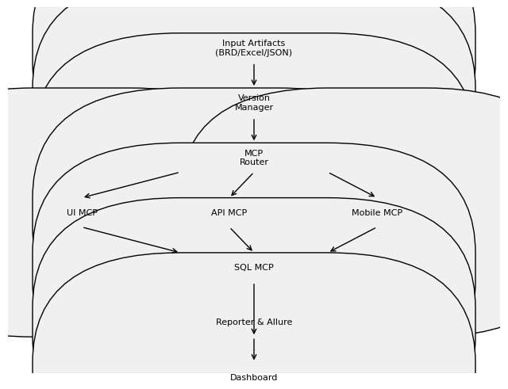

<!--
This markdown file is laid out as a slide deck.  Each second level heading
(`##`) starts a new slide.  The deck explains how the enterprise
automation framework handles versioned test sets, routes tests via the
MCP pattern, and exposes a user interface for managing versions.  The
diagrams in the `diagrams` directory should be embedded when viewing
this file.
-->

# Enterprise Automation Framework – Slides

## Introduction

The goal of this framework is to **democratise test automation** by allowing non‑technical users to upload business requirements documents (BRDs), Excel spreadsheets, Postman collections or Swagger definitions and have them executed automatically.  By leveraging a **Model Context Protocol (MCP)** pattern, the system routes each test to a specialised executor (UI, API, Mobile or SQL) and collects evidence using Allure reports.

## Versioned Test Sets

Every time a user uploads a new BRD or user story, a new **version** of the test set is created.  The version manager stores all versions in a SQLite database along with metadata such as the author and timestamp.  It compares each version to its predecessor:

* **Added** – new test cases that did not exist previously.
* **Removed** – tests present in the previous version but absent now.
* **Unchanged** – tests that carry over unmodified.

Similarity between versions is calculated using the Levenshtein ratio.  If the new version is more than 80 % similar to the previous one, a warning is logged but the version is still saved.

Users can compare any two versions, merge test cases from different versions, or select a specific version to run.  Nothing is ever deleted; even duplicate test cases within the same version are preserved and flagged for review.

## MCP Flow

The **MCP Router** analyses each test case and sends it to one of four executors:

* **UI MCP** – uses Playwright to drive web browsers.  It implements retries, self‑healing selectors and captures screenshots on failure.  Screenshots are attached to Allure reports【986064393896334†L384-L428】.
* **API MCP** – parses English or JSON into HTTP requests, sends them via the `requests` library and validates responses.
* **Mobile MCP** – leverages the Appium client to interact with Android/iOS simulators or devices.  Inspired by the Mobile‑Next server, it uses accessibility trees where possible and falls back to coordinate‑based taps【181552211307042†L292-L340】.
* **SQL MCP** – translates English commands into SQL statements (e.g. “Insert user John Doe”) and asserts results against a SQLite database.

Below is a simplified flow diagram showing how data moves through the system (see also the high‑resolution PNG):

The router is responsible for classification.  If the user specifies the type explicitly, it is used; otherwise, heuristics from `config/config.yaml` match keywords in the test description.

## Deduplication and Self‑Healing

Within a single version, duplicate test identifiers are detected and flagged, but all duplicates remain stored.  Across versions, the framework never discards tests; instead it marks them as removed or unchanged based on the diff.  This design ensures auditability and regulatory compliance.

All MCPs implement **retry logic**.  If a step fails, it is retried up to a configurable number of times.  For UI and Mobile MCPs, selectors are re‑evaluated after each retry; additional locators can be provided for self‑healing.  Failures trigger evidence capture (screenshots, response bodies, SQL logs) which is attached to the Allure report for diagnostics【986064393896334†L384-L428】.

## Dashboard and User Interface

The FastAPI dashboard provides a convenient UI for non‑technical users:

* View all user stories and their versions.
* Compare two versions to see added, removed and unchanged test cases.
* Select a version and trigger its execution.  Progress and results are streamed to Allure.

The UI is intentionally minimal and leverages TailwindCSS for styling.  Developers can extend it to support merging versions or editing test cases directly.

## Conclusion

This framework demonstrates how LLMs, MCPs and traditional test tools can be combined into a cohesive, enterprise‑ready solution.  It emphasises version control, auditability and evidence‑driven reporting, while remaining modular and extensible.  Teams can adapt individual MCPs, add new ones or integrate alternative dashboards without affecting the core routing and versioning logic.